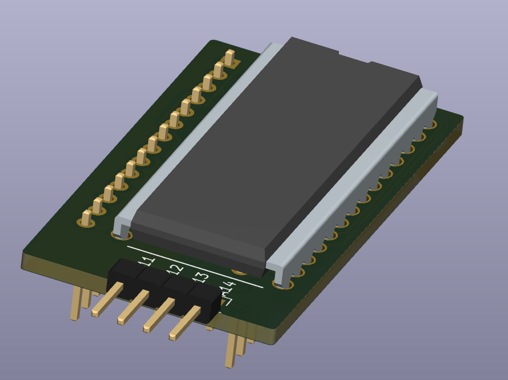

# ZX81 RAM Upgrade
Simple plug-in 32KB RAM for ZX81 &amp; TS1000 using through-hole SRAM.  Expectation is that it's used with the very excellent [vLA81](https://www.vretrodesign.com/products/vla81-zx81-ula-replacement). 

Currently a work-in-progress (9-Sept-2023). 

