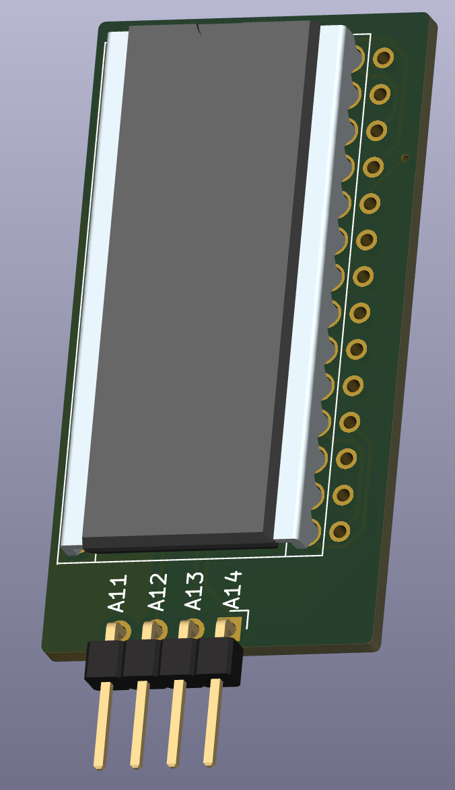

# ZX81 Projects

## ZX81 RAM Upgrade
Simple plug-in 32KB RAM for ZX81 &amp; TS1000 using through-hole SRAM.  Expectation is that it's used with the very excellent [vLA81](https://www.vretrodesign.com/products/vla81-zx81-ula-replacement). 

{Fri 15-Sept-2023} 
Sent board prototype for fabrication 

## ZX81 Centronics Interface
Redrawn from the original c't magazine schematic. 
{Sat 16-Sept-2023} 
Work in progress